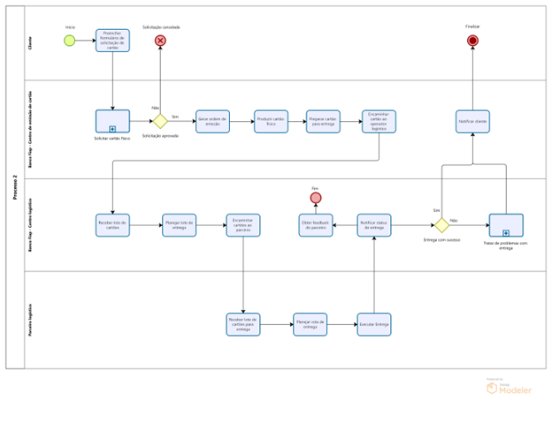
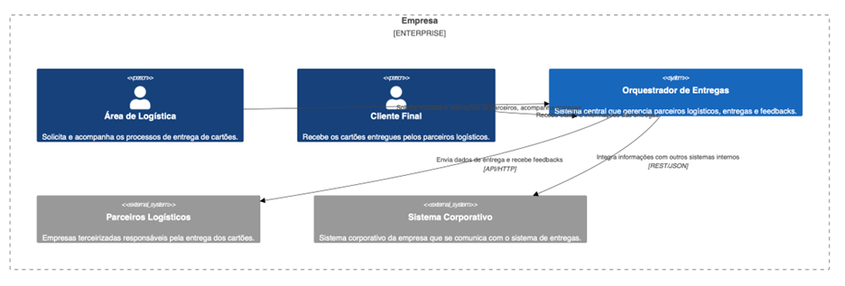
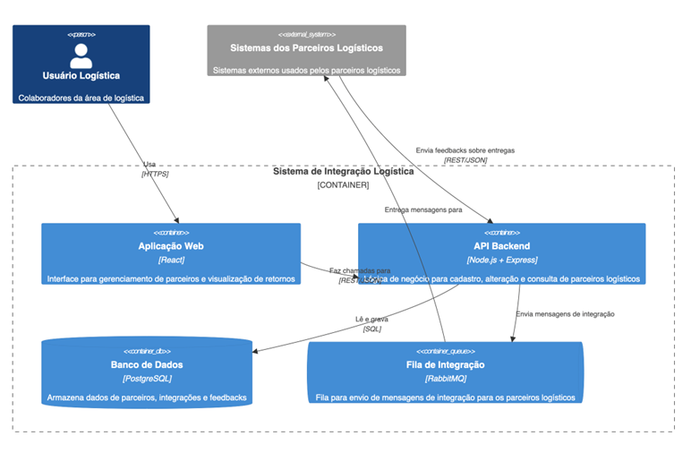
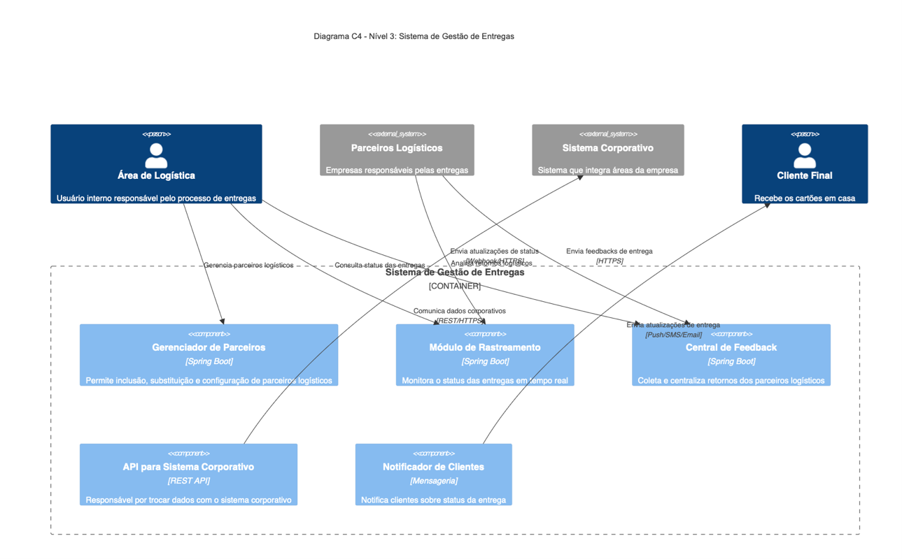

# IT_Architecture_Design-Styles
### Contribuintes:
- [@margato](https://github.com/margato)
- [@edersonvmv](https://github.com/edersonvmv)
- [@digaoguimaraes](https://github.com/digaoguimaraes)
- [@fhideki10](https://github.com/fhideki10)

## Objetivos de Aprendizado do Projeto  
Esperamos entender melhor o modelo de negócio e o valor entregue ao stakeholder, gerando impacto positivo por meio da definição clara de requisitos funcionais e não funcionais. Também buscamos aplicar e consolidar conhecimentos sobre padrões de arquitetura, como acesso à base de dados, segurança, troca de eventos e boas práticas de integração. Com isso, aprendemos durante o processo e garantimos um bom resultado ao final.

## Perguntas que Precisam Ser Respondidas  
1. Qual é o budget do projeto?  
2. Qual é a volumetria de entregas por setor (cartões, bobinas, tags veiculares)?  
3. Quantos parceiros de entrega existem atualmente?  
4. Existem políticas corporativas que impactam diretamente este projeto?

## Principais Riscos  
- Estamos lidando com produtos críticos, como cartões. Qualquer falha pode gerar fraudes, afetando diretamente o cliente final e a reputação da empresa.  
- Desvios operacionais podem impactar juridicamente a organização.  
- Para mitigar os riscos, é essencial contar com feedbacks contínuos das entregas e monitoramento de ponta a ponta.

## Plano de Aprendizado para Responder às Perguntas  
- Criar um formulário direcionado às áreas envolvidas para levantamento de requisitos.  
- Realizar entrevistas com as áreas técnicas e de negócio para capturar requisitos não funcionais.  
- Agendar reuniões com stakeholders para alinhar expectativas e definir objetivos de entrega.

## Plano para Redução de Riscos  
- Implementar monitoramento contínuo e feedbacks sobre cada requisição.  
- Aplicar critérios de escolha de parceiros com base em performance e segurança.  
- Utilizar arquitetura resiliente, com fallbacks e abstração de comunicação, garantindo continuidade mesmo em caso de falhas pontuais.

## Partes Interessadas (Stakeholders)  
- Cliente final (maior interessado).  
- Executivos e diretores da empresa.  
- Áreas internas que utilizarão a aplicação.  
- Fornecedores/parceiros logísticos, que passam a ter maior relevância estratégica no ecossistema da entrega.

## Expectativas das Partes Interessadas  
- Alta performance e eficiência operacional.  
- Centralização da gestão de entregas.  
- Redução de custos via contratos em massa.  
- Maior controle e visibilidade dos processos.

## Quem são os Usuários da Solução?  
Áreas internas que realizam entregas de objetos para clientes internos e externos.

## Objetivos dos Usuários  
- Centralizar entregas em um único sistema.  
- Abstrair a integração com os fornecedores.  
- Otimizar contratos com fornecedores.  
- Segregar custos por área.  
- Implementar fallback para fornecedores.

## Pior Cenário Possível  
- Quebra de contrato jurídico com fornecedores.  
- Danos à imagem da empresa e perda de confiança dos clientes.

## Descrição dos Componentes da Arquitetura  
- **Canais**: Interfaces para acesso à solução.  
- **API Gateway**: Roteamento de requisições, agregando funcionalidades como autenticação e controle de tráfego.  
- **Serviço de IAM**: Gerenciamento dos acessos de usuários e serviços, garantindo segurança por meio de permissões e autenticação.  
- **Firewall**: Monitora e filtra o tráfego de rede, protegendo contra acessos não autorizados e ameaças externas.  
- **Microserviços**: Divisão de responsabilidades e independência entre componentes.  
- **Cache**: Armazenamento dos dados temporariamente para acelerar o acesso a informações frequentemente requisitadas.  
- **Load Balancer**: Distribuição de carga entre servidores, otimizando a performance e garantindo alta disponibilidade do sistema.  
- **Banco de Dados NoSQL**: Armazenamento de dados escalável e flexível.  
- **Tópicos/Eventos**: Comunicação assíncrona entre componentes, utilizado em sistemas de mensagens para distribuir eventos entre produtores e consumidores.  
- **Object Storage**: Armazenamento escalável e flexível para dados não estruturados, como arquivos e imagens, acessados por identificadores únicos.

## Requisitos Importantes  
1. Abstração da comunicação com fornecedores – facilita mudanças sem impacto no negócio.  
2. Consultas separadas do fluxo operacional – respostas rápidas e otimizadas.  
3. Fallbacks operacionais – continuidade mesmo com falhas pontuais.  
4. Escalabilidade e disponibilidade – suportar aumento de carga com performance.  
5. Arquitetura orientada a eventos – observabilidade e redução de dependências.  
6. Segurança de acesso e autenticação – proteção contra acessos indevidos.  
7. Governança de acesso por função – evita exposição indevida de dados e funções.

## Utilidade do Diagrama  
- Auxilia no entendimento dos fluxos operacionais.  
- Identifica pontos críticos antes de implementar tecnologias.  
- O diagrama BPMN foi essencial para visualizar os processos de negócio.

## Padrões Essenciais e Ocultos Utilizados  
**Padrões Essenciais**:  
- Event Sourcing  
- CQRS  
- Client-Server  
- Microservices

**Padrões Ocultos**:  
- Circuit Breaker  
- Fallback  
- Zero Trust Architecture  
- Least Privilege

## Metamodelo Utilizado  
O metamodelo que estamos utilizando segue os princípios do modelo C4, onde os elementos da arquitetura são organizados em quatro níveis: contexto, contêiner, componente e código. Cada nível define tipos específicos de elementos e relacionamentos, o que permite uma modelagem estruturada e incremental da solução.

## Limitações do Diagrama Atual  
- Não é autoexplicativo com um único diagrama.  
- Evidenciamos apenas as regras de negócios e os conceitos de arquitetura, seria necessário complementar com diagramas de segurança/rede.  
- Pode ser simplificado, se necessário, para controle de custos sem perder eficiência.

## Discussões Relevantes da Equipe  
- Como abstrair a comunicação com os fornecedores com segurança e fallback.  
- Dificuldade em definir os protocolos de comunicação com os parceiros.  
- Integrações com fornecedores foram feitas sob incertezas e decisões sem retorno que exigiram revisão do modelo.

## Modelagem de processos – BPMN

### Nível Contexto

### Nível Container

### Nível Componente

